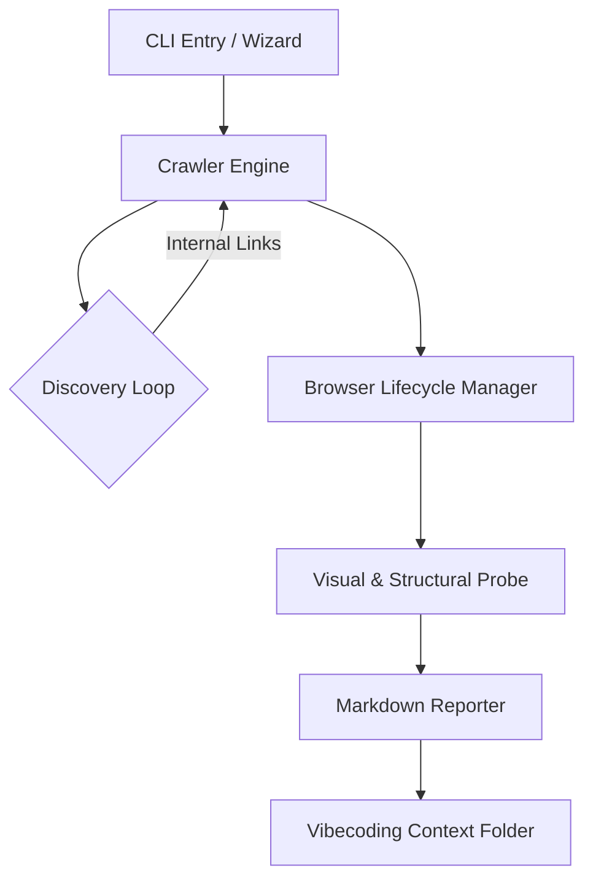

# 🛠 Under the Hood: The SiteScope Architecture

Think of SiteScope as a **High-Fidelity Optical Probe** for your web development workflow. While most crawlers just look at the code, SiteScope looks at the **Experience**. This document is a deep-dive into the engineering principles and the software stack that makes SiteScope a premier tool for the vibecoding era.

---

## 🏗 High-Level Architecture

SiteScope is built on a **Modular ESM (ECMAScript Module)** architecture. It avoids the complexities of monolithic designs by separating the "Discovery" (Crawling) from the "Analysis" (Rendering).

---

## 1. The Crawler Engine: Breadth-First Discovery
The heart of SiteScope is a custom **BFS (Breadth-First Search)** crawler. Unlike depth-first crawlers that can get caught in infinite "nested folder" loops, BFS ensures we see the most important top-level pages first.

### 🧠 Intelligent Filtering Logic:
- **Domain Locking**: The crawler uses strict string matching to ensure it never leaks into external domains (like Google Analytics, Facebook SDKs, or CDNs). This keeps your data clean and your scan fast.
- **URL Normalization**: We use the native Node.js `URL` API to normalize relative paths. `../about` becomes a full absolute URL, and fragments like `#contact` are stripped to prevent duplicate scans of the same page.
- **The "Developer Threshold"**: We implemented a strict counter for discovered pages. Once the `maxPages` (default 25) is reached, the queue is locked. This prevents accidental "Infinite Crawls" on massive production sites.

---

## 2. Browser Management: Playwright Integration
Most developer tools use `jsdom` or `cheerio`, which are purely text-based. SiteScope uses **Playwright**—a full-scale, headless Chromium engine.

### 🚀 Why a full browser?
- **Modern Rendering**: It handles CSS Grid, Flexbox, and complex animations exactly like a real user's browser.
- **JavaScript Execution**: It executes React, Vue, Svelte, and Next.js hydration logic. Without this, your AI agent would only see a blank "Loading..." screen.
- **Context Isolation**: For every scan, we create a fresh, "Incognito-style" Browser Context. This ensures no cookies or cache from previous runs interfere with the audit.

---

## 3. The "Visual & Structural Probe" Stage
This is where the magic happens for Vibecoding. For every page discovered, SiteScope performs a series of "Probes":

### 📸 Probes include:
- **Auto-Scroll Analysis**: SiteScope doesn't just open a page; it programmatically scrolls to the bottom and back up. This triggers **Lazy-Loading** for images and reveals "Sticky" or "Fixed" element bugs that simple tools miss.
- **Multi-Device Simulation**: Using Playwright viewports, we snap the exact same page state across **Desktop (1280x800)**, **Tablet (768x1024)**, and **Mobile (375x667)**. 
- **Console Monitoring**: We hook into the browser's `console` event. Any red errors in the devtools are sucked directly into your SiteScope report.
- **DOM Structure Analysis**: We look for high-level semantic tags (H1-H6, Main, Nav) to provide structural context to AI agents.

---

## 4. Output: The Vibecoding Bridge
SiteScope's output isn't just a "pretty report." It is designed to be **LLM-Parseable**.

- **Human-Readable Markdown**: We generate a `report.md` that uses standard GitHub Flavored Markdown. This is the "Native Language" of AI models like Claude and GPT.
- **Image Mapping**: Every screenshot is named clearly (e.g., `about-mobile.png`) and linked directly in the report. When you provide this folder to a vibecoding agent, it can instantly correlate a "broken button" in the image with the specific route in the code.

---

## 5. CLI & Global Linking (The Windows Magic)
On Windows, we use `npm link` and a carefully crafted `bin` entry in our `package.json`.

- **Global Shim**: When you run the installer, Windows creates a small `.cmd` or `.ps1` wrapper. 
- **Execution Context**: Even though you run `sitescope` in `C:\MyProject\`, the command-line arguments are passed back to our project directory. 
- **Relative Path Handling**: We use `process.cwd()` to ensure that even though the "Brain" of SiteScope lives in its own folder, the "Eyes" see exactly where you are currently working.

---

## 🏗 The Stack Summary
- **Runtime**: Node.js (ESM)
- **CLI Framework**: Commander.js
- **Interactive Prompts**: Inquirer.js
- **Browser Engine**: Playwright (Chromium)
- **Styling**: Chalk & ANSI Colors
- **Reporting**: Markdown Engine

---

### **Vibecoding Loop Explained**
1.  **Code**: You write code in your IDE.
2.  **Scope**: You run `sitescope` to see how it "vibes."
3.  **Vibe**: You feed the screenshots back to the AI.
4.  **Repeat**: The AI "sees" the UI bugs and fixes the code. 

**SiteScope isn't just a tool; it's the missing feedback loop for the AI generation of software.**

---

## 🎭 **The Developer's Confession**

> "To be honest, even as the 'developer' (kind of... maybe a vibecoder? idk), I don't fully know what all this complex under-the-hood stuff is. If you're a nerd and you understand it—that’s your right! 
> 
> I made this software **entirely using AI**. All I know is that it’s a terminal executable, it runs on Node.js, and it works like magic. That’s the true power of **Vibecoding**." — *The Creator*

---

🔭 *Build better, see clearer, vibe faster.*
